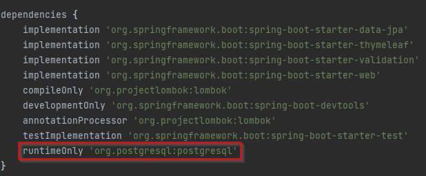
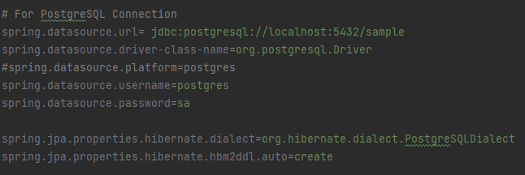
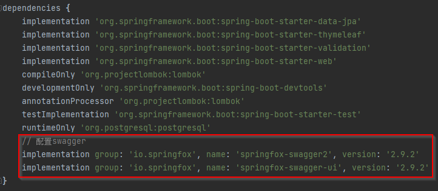

# my_project2
Start project2 in 2022/01/03

# Setting PostgreSQL

## build.gradle
### Comment: runtimeOnly 'mysql:mysql-connector-java'
### Add: runtimeOnly 'org.postgresql:postgresql'


## application.properties
### Added PostgreSQL Connect


# Setting Swagger
## Add Dependence In build.gradle


## Add Java Class -> MyWebConfig
```MyWebConfig
package com.systex.test.demo.config;

import org.springframework.context.annotation.Configuration;
import org.springframework.web.servlet.config.annotation.EnableWebMvc;
import org.springframework.web.servlet.config.annotation.ResourceHandlerRegistry;
import org.springframework.web.servlet.config.annotation.WebMvcConfigurationSupport;

@Configuration
public class MyWebConfig extends WebMvcConfigurationSupport {
    //載入靜態資源
    @Override
    protected void addResourceHandlers(ResourceHandlerRegistry registry) {
        super.addResourceHandlers(registry);
        registry.addResourceHandler("/**")
                        .addResourceLocations("classpath:/static/");
        registry.addResourceHandler("swagger-ui.html")
                .addResourceLocations("classpath:/META-INF/resources/");
        registry.addResourceHandler("/webjars/**")
                .addResourceLocations("classpath:/META-INF/resources/webjars/");
    }
}
```

## Add Java Class -> SwaggerConfiguration
```SwaggerConfiguration
package com.systex.test.demo.config;

import org.springframework.boot.context.properties.EnableConfigurationProperties;
import org.springframework.context.annotation.Bean;
import org.springframework.context.annotation.Configuration;
import org.springframework.web.servlet.config.annotation.EnableWebMvc;
import org.springframework.web.servlet.config.annotation.ResourceHandlerRegistry;
import org.springframework.web.servlet.config.annotation.WebMvcConfigurationSupport;
import springfox.documentation.builders.ApiInfoBuilder;
import springfox.documentation.builders.PathSelectors;
import springfox.documentation.builders.RequestHandlerSelectors;
import springfox.documentation.service.ApiInfo;
import springfox.documentation.spi.DocumentationType;
import springfox.documentation.spring.web.plugins.Docket;
import springfox.documentation.swagger2.annotations.EnableSwagger2;

/**
 * @Author: Jerry Cheng
 * @CreateTime: 2022-01-01 19:11
 * Swagger 配置類
 */
@Configuration
@EnableSwagger2
public class SwaggerConfiguration extends WebMvcConfigurationSupport {
    @Bean
    public Docket createRestApi(){
        // DocumentationType.SWAGGER_2 固定的，代表swagger2
        return new Docket(DocumentationType.SWAGGER_2)
                // 用於生成API資訊
                .apiInfo(apiInfo())
                // select()函式返回一個ApiSelectorBuilder例項,用來控制介面被swagger做成文件
                .select()
                // 用於指定掃描哪個Package下的介面
                .apis(RequestHandlerSelectors.basePackage("com.systex.test"))
                // 選擇所有的API,如果你想只為部分API生成文件，可以配置這裡
                .paths(PathSelectors.any())
                .build();
    }

    private ApiInfo apiInfo(){
        return new ApiInfoBuilder()
                // 可以用來自定義API的主標題
                .title("標題: Spring Boot中使用Swagger2構建RESTFul APIs")
                // 可以用來描述整體的API
                .description("相關說明")
                .termsOfServiceUrl("") // 用於定義服務的域名
                .version("1.0") // 可以用來定義版本。
                .build();
    }
}
```

## 使用說明
### 文件網址: `https://github.com/swagger-api/swagger-core/wiki/Annotations`
## 測試網址
### Swagger: `http://localhost:8080/v2/api-docs`
### API文件預覽: `http://localhost:8080/swagger-ui.html`
